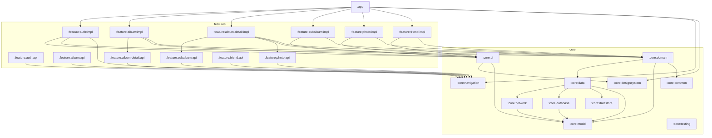

# Momentwo 멀티모듈 마이그레이션 계획

> 본 문서는 Android 공식 권장 아키텍처([Guide to app architecture](https://developer.android.com/topic/architecture), [Architecture recommendations](https://developer.android.com/topic/architecture/recommendations))와 [Now in Android](https://github.com/android/nowinandroid)(이하 NIA) 구현을 참고해, Momentwo 앱을 단일 모듈에서 멀티모듈로 전환하기 위한 실행 계획이다. GitHub Wiki 이관을 전제로 작성한다.

---

## 1. 배경 (Context)

Momentwo는 현재 `:app` 단일 모듈로 구성된 Android 앱이다. 패키지 단계에서는 이미 `data / domain / ui / di` 3계층 분리와 도메인별 폴더 구조(album, photo, friend, subalbum 등)가 갖춰져 있어 공식 권장 아키텍처에 큰 무리 없이 부합한다.

그러나 단일 모듈에서 비롯되는 한계가 누적되고 있다.

- **빌드 시간**: 작은 UI 변경에도 전체 모듈이 재컴파일된다.
- **결합도**: `data` 구현체와 `ui`가 같은 모듈에 있어 잘못된 의존(예: UI에서 `*RepositoryImpl` 직접 참조)을 컴파일러가 막지 못한다.
- **경계 모호함**: feature 간 import가 자유로워, 향후 한 화면 단위로 떼어 내거나 라이브러리화하기 어렵다.
- **재사용 단위 부재**: theme/composable/공용 모델 등이 명확한 "core"로 묶여 있지 않다.

이 계획은 **공식 권장사항과 NIA 구조를 Momentwo 규모에 맞게 축약**해 점진적으로 적용한다.

## 2. 설계 결정 요약

| 항목 | 선택 | 근거 |
|---|---|---|
| Feature 분할 단위 | 혼합 6개 (`auth`, `album`, `album-detail`, `photo`, `friend`, `subalbum`) | 화면 단위(11개)는 모듈이 과다, 도메인 4개는 album 모듈이 비대해짐. 중간 절충 |
| api/impl 분리 | **적용** (NIA 방식) | cross-feature 이동 시 Route 키만 노출하여 결합도 최소화 |
| Domain 위치 | `:core:domain`(UseCase) + `:core:data`(Repository 인터페이스) | NIA와 동일. UseCase 재사용성 보장 |
| 마이그레이션 | 단계적 전체 마이그레이션 (Phase 0 → 3) | 각 PR이 독립적으로 빌드/런타임 가능 |

## 3. 목표 아키텍처

### 3.1 모듈 트리

```
:app                              ← MomentwoApplication, MainActivity, NavHost, Theme 연결

build-logic/                      ← includeBuild
  └─ convention/                  ← 모든 convention plugin

:core:model                       ← 순수 Kotlin. 도메인 모델(AlbumItem, PhotoItem 등)
:core:common                      ← Dispatcher, Result, 공통 확장
:core:network                     ← Retrofit, OkHttp, AuthInterceptor, MomentwoApi
:core:database                    ← Room(MomentwoDatabase, Dao, Entity, RemoteMediator)
:core:datastore                   ← PreferenceRepository(토큰/세션)
:core:data                        ← Repository 인터페이스 + Impl, 데이터 소스 통합
:core:domain                      ← UseCase
:core:designsystem                ← Theme, Color, Type, 기본 컴포넌트
:core:ui                          ← 도메인성 공유 Composable(AlbumItemCard, UserItemBox 등)
:core:navigation                  ← Route 키, 공통 NavType, NavGraph 빌더 인터페이스
:core:testing                     ← FakeRepository, MainDispatcherRule 등

:feature:auth:api                 ← LoginRoute, SignUpRoute (NavKey만)
:feature:auth:impl                ← Login/SignUp Screen+VM+Contract
:feature:album:api
:feature:album:impl               ← Album, CreateAlbum
:feature:album-detail:api
:feature:album-detail:impl        ← AlbumDetail, AlbumSetting, ChangeImage, Member
:feature:subalbum:api
:feature:subalbum:impl            ← SubAlbumList
:feature:photo:api
:feature:photo:impl               ← PhotoList, PhotoDetail, Comment, Like, Description
:feature:friend:api
:feature:friend:impl              ← Friend, FriendRequest, FriendList
```

총 **24개 include 모듈** (`:app` 1 + `:core:*` 11 + `:feature:*` 12). `build-logic`은 `includeBuild`로 별도.

### 3.2 화면 → Feature 매핑 (sub-feature 흡수)

| 기존 UI 폴더 | 흡수 대상 |
|---|---|
| `login`, `signup` | `:feature:auth` |
| `album`, `createalbum` | `:feature:album` |
| `albumdetail`, `albumsetting`, `changeimage`, `member` | `:feature:album-detail` |
| `subalbumlist` | `:feature:subalbum` |
| `photolist`, `photodetail`, comment/like/description 부속 | `:feature:photo` |
| `friend`, `friendrequest`, `friendlist` | `:feature:friend` |

### 3.3 의존성 규칙

```
:app ─────────────► :feature:*:impl, :feature:*:api, :core:*
:feature:X:impl ──► :feature:Y:api    (cross-feature 이동은 api만 봄)
:feature:X:impl ──► :core:*
:feature:X:api ───► :core:navigation, :core:model    (그 외 금지)
:core:Y ──────────► :core:X            (단방향만)
:core:domain ─────► :core:data, :core:model, :core:common
:core:data ───────► :core:network, :core:database, :core:datastore, :core:model
:core:ui ─────────► :core:designsystem, :core:model
```

**금지**:
- `:core:* → :feature:*` (절대)
- `:feature:X:impl → :feature:Y:impl` (api만 허용)
- `:core:network ↔ :core:database` 직접 의존 (둘 다 `:core:data`로만 흐름)

### 3.4 Mermaid 그래프



## 4. Convention Plugin (`build-logic/convention`)

NIA의 16개를 다음 **9개**로 축약한다.

| Plugin id | 적용 모듈 | 책임 |
|---|---|---|
| `momentwo.android.application` | `:app` | AGP application, compileSdk/minSdk, Java 17, Kotlin |
| `momentwo.android.application.compose` | `:app` | Compose BOM, compose compiler |
| `momentwo.android.library` | 모든 `:core:*`, `:feature:*` | AGP library + Kotlin 공통 |
| `momentwo.android.library.compose` | `:core:designsystem`, `:core:ui`, `:feature:*:impl` | Compose 옵션 |
| `momentwo.android.feature` | `:feature:*:impl` | library.compose + Hilt + 기본 의존성(core:ui, core:designsystem, core:domain, core:navigation, lifecycle, navigation-compose) |
| `momentwo.android.hilt` | Hilt 필요 모듈 | hilt plugin + dagger-hilt + ksp |
| `momentwo.android.room` | `:core:database` | room plugin + schema 디렉토리 |
| `momentwo.android.network` | `:core:network` | retrofit + okhttp + moshi 묶음 |
| `momentwo.jvm.library` | `:core:model`, `:core:common` | 순수 Kotlin JVM 모듈 |

`gradle/libs.versions.toml`에 plugin 카탈로그 추가: `momentwo-android-application`, `momentwo-android-library`, … (NIA `libs.plugins.nowinandroid.*` 패턴 모방.)

## 5. 마이그레이션 단계

각 단계는 **별도 PR**, 빌드와 런타임이 깨지지 않음을 검증한 후 머지한다.

### Phase 0 — 기반 정비 (PR 1)

- `build-logic/convention` 디렉토리 생성, `settings.gradle.kts`에 `includeBuild("build-logic")` 추가.
- 위 9개 convention plugin 작성 (NIA `build-logic/convention/src/main/kotlin/` 참고).
- `:app/build.gradle.kts`를 convention plugin 적용 형태로 리팩터링 (모듈 분할 전이라도 적용 가능).
- `gradle/libs.versions.toml`에 plugin 카탈로그 보강, version catalog 표준화.
- **검증**: `./gradlew :app:assembleDebug`, `:app:lintDebug` 통과, 앱 실행 동일.

### Phase 1 — Core 분리 (PR 2~12, 모듈당 1 PR)

의존이 가장 적은 것부터:

1. `:core:model` — `ui/model/*` + `data/model/*` 중 도메인 모델 이동. JVM library.
2. `:core:common` — Dispatcher, Result, 공통 확장(필요 시 신설).
3. `:core:network` — `data/MomentwoApi.kt`, `data/authentication/AuthInterceptor`, `AuthAuthenticator`, ApiModule 이동. DTO는 모듈 내부에만 보관(외부 노출 X), `:core:model` 모델로 매핑.
4. `:core:datastore` — `data/authentication/PreferenceRepository*`, `PreferenceKeys` 이동.
5. `:core:database` — `data/MomentwoDatabase`, 각 도메인의 `local/*Dao`, `*Entity`, `RemoteKey*` 이동.
6. `:core:data` — 모든 `*RepositoryImpl`, `*DataSource`, `*RemoteMediator` 이동. Repository 인터페이스도 함께. di 모듈(`AlbumModule` 등)도 이관.
7. `:core:designsystem` — `ui/theme/Color.kt`, `Type.kt`, `Theme.kt` + 기본 컴포넌트.
8. `:core:ui` — `ui/composable/*` (AlbumItemCard, CircleAsyncImage, UserItemBox 등).
9. `:core:domain` — 모든 UseCase 이동(`GetAlbumListUseCase`, `DownloadPhotoUseCase`, `ChangeSubAlbumTitleUseCase` 등).
10. `:core:navigation` — `MomentwoNavGraph`/`MomentwoNavigation`의 Route 키 + 공용 NavType + `FeatureNavGraphBuilder` 인터페이스만 분리. NavHost 본체는 `:app`에 잔존.
11. `:core:testing` — Fake 더블, 공용 테스트 유틸 (필요 시 마지막).

각 PR 검증: `./gradlew :core:<x>:assembleDebug :app:assembleDebug` 통과 + 앱 골든 패스 수동 확인.

### Phase 2 — Feature 분리 (PR 13~18, feature당 1 PR)

의존이 단순한 것부터:

1. `:feature:auth` — `:core:data`만 의존, cross-feature 의존 없음. 가장 안전.
2. `:feature:friend`
3. `:feature:subalbum`
4. `:feature:album-detail` (`:feature:subalbum:api`, `:feature:photo:api` 필요 → 둘은 빈 api 스텁으로 먼저 분리)
5. `:feature:album` (`:feature:album-detail:api` 필요)
6. `:feature:photo`

각 feature는 동시에 `:api`와 `:impl` 두 모듈로 떼어낸다.
- `:feature:X:api` — `XRoute.kt`(NavKey, `@Serializable` data class) + Route 인자 모델만.
- `:feature:X:impl` — `momentwo.android.feature` plugin 적용, `NavGraphBuilder.xScreen()` 확장 함수로 그래프 등록.

`:app`은 모든 `:feature:*:impl`에 의존하고 NavHost 안에서 `albumScreen() / photoScreen() / …` 호출.

각 PR 검증: `./gradlew :feature:<x>:impl:assembleDebug :app:assembleDebug` 통과 + 해당 feature 진입/이탈 동작 확인.

### Phase 3 — `:app` 슬림화 + 마무리 (PR 19)

- `:app/src/main/java`에는 Application, MainActivity, MomentwoApp Composable(NavHost 연결), 앱 레벨 Theme 적용만 잔존.
- 사용하지 않는 `:app` 내 패키지/import 정리.
- README와 본 문서 최신화.

## 6. 주요 파일 매핑 (이동 표)

| 현재 경로 | 이동 후 |
|---|---|
| `data/MomentwoApi.kt` | `:core:network` |
| `data/MomentwoDatabase.kt` | `:core:database` |
| `data/authentication/AuthInterceptor`, `AuthAuthenticator` | `:core:network` |
| `data/authentication/Preference*` | `:core:datastore` |
| `data/*/`(repo impl, datasource) | `:core:data` |
| `data/model/`(DTO) | `:core:network` (모듈 내부) |
| `data/*/local/`(Dao, Entity) | `:core:database` |
| `data/*/local/RemoteKey*` | `:core:database` |
| `data/*/RemoteMediator*` | `:core:data` |
| `domain/**/*UseCase.kt` | `:core:domain` |
| `domain/**/*Repository.kt`(interface) | `:core:data/repository/` |
| `ui/theme/` | `:core:designsystem` |
| `ui/composable/` | `:core:ui` |
| `ui/model/` | `:core:model` |
| `ui/MomentwoNavGraph.kt` (Route 키) | `:core:navigation` |
| `ui/MomentwoNavGraph.kt` (NavHost) | `:app` |
| `ui/<feature>/*Route.kt` | `:feature:<feature>:api` |
| `ui/<feature>/*Screen.kt`, `*ViewModel.kt`, `*Contract.kt` | `:feature:<feature>:impl` |
| `di/ApiModule`, `AuthModule` | `:core:network` |
| `di/DatabaseModule` | `:core:database` |
| `di/<domain>Module.kt` | `:core:data` (Repository 바인딩) |

## 7. 명명 규칙 (공식 권장 적용)

- 메서드: 동사구 (`makePayment()`)
- 속성: 명사구 (`inProgressTopicSelection`)
- Flow 스트림: `getXxxStream()` / 리스트면 `getXxxsStream()`
- Repository: 인터페이스 `AlbumRepository`, 기본 구현 `DefaultAlbumRepository`(오프라인 우선이면 `OfflineFirstAlbumRepository` 패턴). 현재의 `*RepositoryImpl` 명명은 점진 통일 권장.
- Fake: `FakeAlbumRepository`.
- ViewModel 상태 노출: 단일 `uiState: StateFlow<XxxUiState>` + `SharingStarted.WhileSubscribed(5_000)`.
- UI 수집: `collectAsStateWithLifecycle()` (raw `collectAsState()` 지양).

## 8. 검증 절차

**빌드**:
- `./gradlew clean assembleDebug` — 전체 모듈 빌드 통과
- `./gradlew :app:installDebug` — 앱 설치
- `./gradlew lintDebug ktlintCheck detekt` (현재 도구 기준)

**런타임 (수동 골든 패스)**:
1. 신규 회원가입 → 로그인 (`:feature:auth`)
2. 앨범 리스트 → 앨범 생성 → 앨범 상세 (`:feature:album` → `:feature:album-detail`)
3. 서브앨범 진입 → 사진 리스트 → 사진 상세 (`:feature:subalbum` → `:feature:photo`)
4. 좋아요/댓글/설명 (`:feature:photo`)
5. 친구 추가/목록 (`:feature:friend`)
6. 앨범 멤버 관리 (`:feature:album-detail`)

각 Phase 종료 후 위 6개 시나리오를 골든 패스로 사용. 회귀가 잡히면 해당 PR 머지 보류.

## 9. 리스크 및 대응

| 리스크 | 대응 |
|---|---|
| Hilt 다중 모듈 그래프 깨짐 | `@HiltAndroidApp`은 `:app`에만. `@InstallIn(SingletonComponent::class) @Module`은 각 모듈에 분산. `@HiltViewModel`은 `:feature:*:impl`에만. `momentwo.android.hilt` plugin이 일관 적용 보장 |
| Room schema 위치 변경 | `:core:database`로 이동 시 `schemaLocation` 경로를 기존과 동일하게 유지. plugin에서 옵션 강제 |
| DTO ↔ Model 매핑 누락 | 현재 `data/model/*`이 UI 모델과 혼재할 수 있음. Phase 1 step 3~6 사이 매퍼 함수 정리 |
| Type-safe Navigation Route 직렬화 | `:core:navigation`의 Route data class에 `@Serializable` 적용, `kotlinx-serialization`을 catalog에 명시 |
| 빌드 시간 일시적 증가 | `gradle.properties`에 `org.gradle.configuration-cache=true`, `org.gradle.caching=true`, `org.gradle.parallel=true` 확인 |
| 순환 의존 발생 | feature 분리 시 의존하는 다른 feature의 `:api` 스텁을 먼저 만든 뒤 본 feature를 분리 |

## 10. 후속 문서 (선택)

- `docs/architecture/module-graph.md` — 모듈 그래프 단독 페이지 (Wiki 사이드바 인용용)
- `docs/architecture/naming-conventions.md` — 공식 권장 명명 규칙 단독 페이지
- `docs/architecture/adr/0001-multi-module.md` — 결정 기록(ADR)

## 11. 참고 자료

- [Android Guide to app architecture](https://developer.android.com/topic/architecture)
- [Android Architecture recommendations](https://developer.android.com/topic/architecture/recommendations)
- [Now in Android — ModularizationLearningJourney](https://github.com/android/nowinandroid/blob/main/docs/ModularizationLearningJourney.md)
- [Now in Android — ArchitectureLearningJourney](https://github.com/android/nowinandroid/blob/main/docs/ArchitectureLearningJourney.md)
- [Now in Android — build-logic/convention](https://github.com/android/nowinandroid/tree/main/build-logic/convention)
